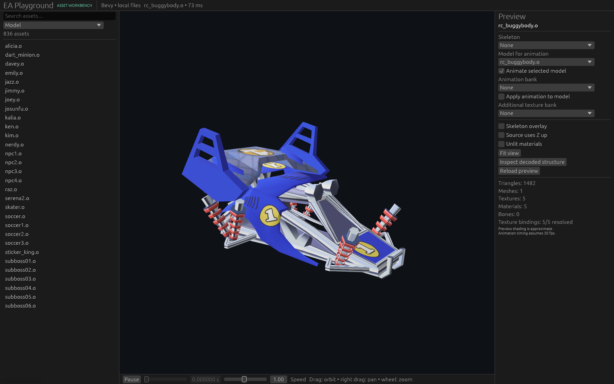
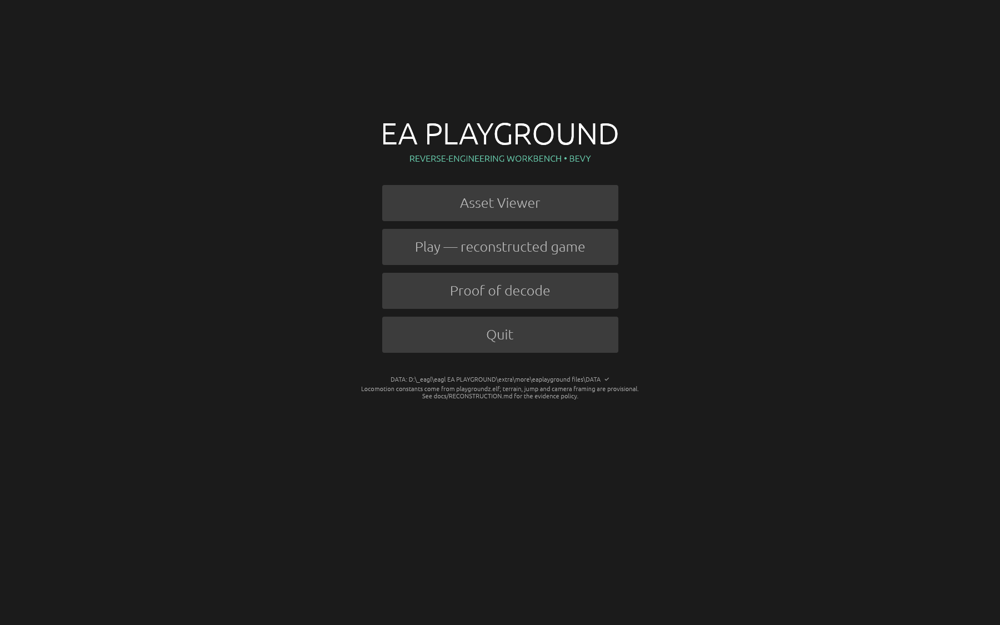
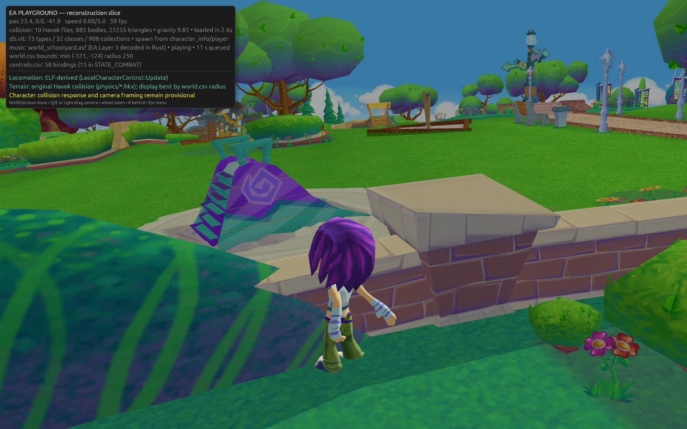
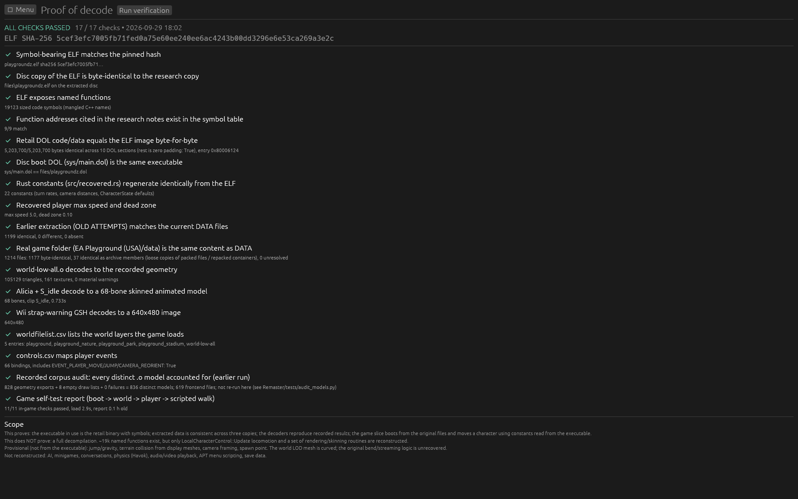
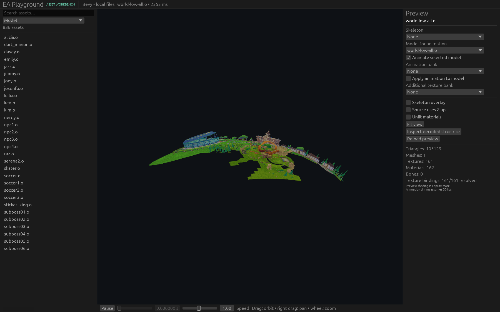
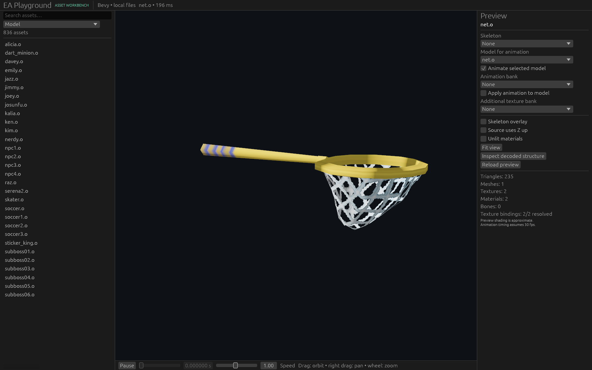
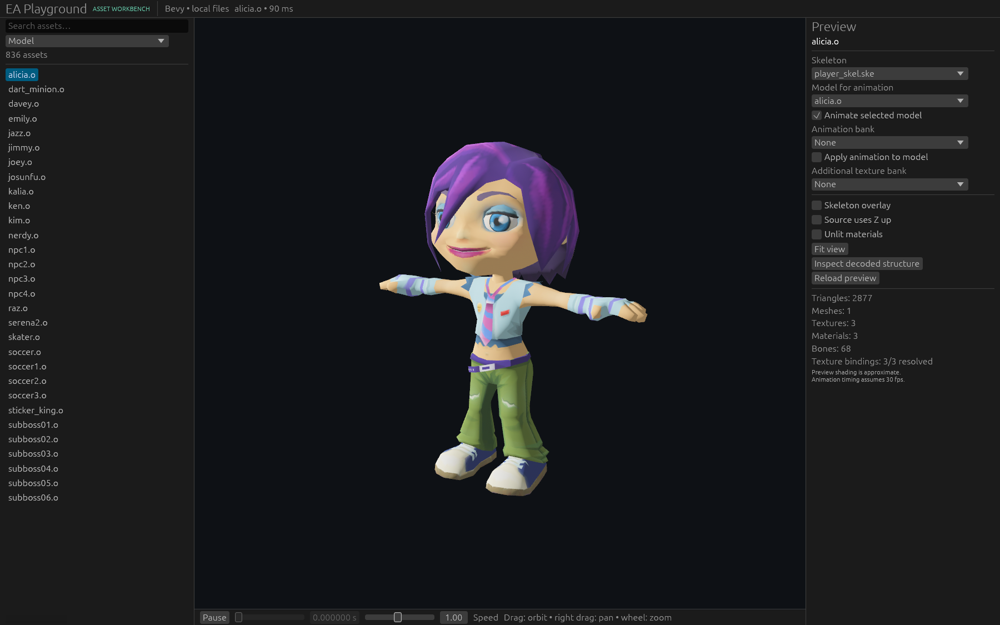
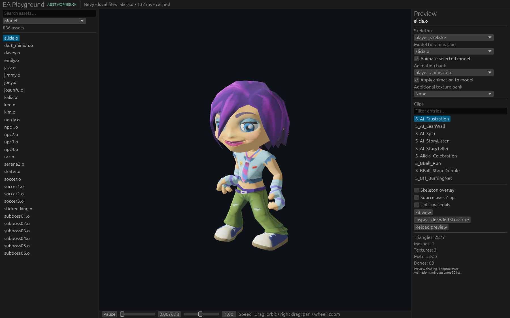
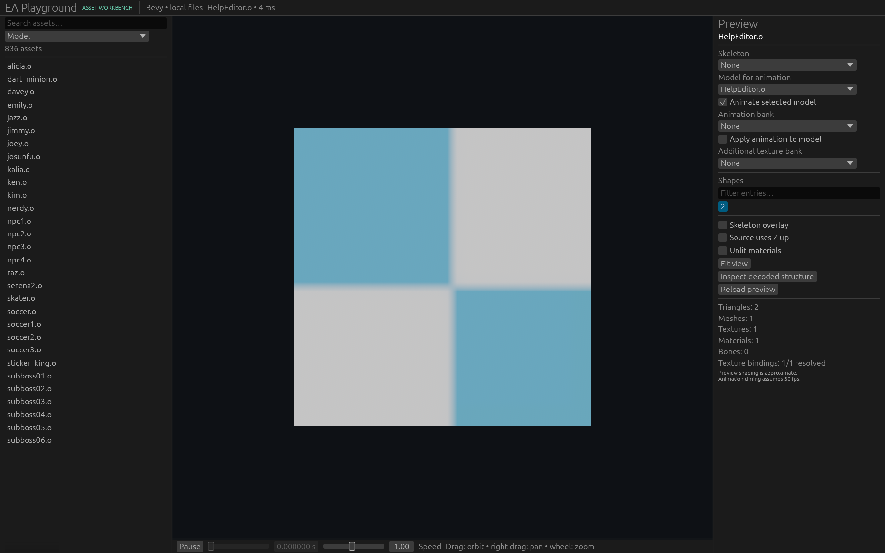

# EA Playground — asset workbench and reconstruction research

[HTML progress dashboard](https://kxboo.github.io/EA-Playground/) · [Publishing and local preview](GameMap/docs/11-progress-site.md)
The dashboard is published by GitHub Pages after the GameMap branch is merged into `main` and its deployment succeeds.

A native **Bevy asset viewer** and a shared, headless decoding toolkit for the Wii version of EA Playground. Browse archives, inspect formats, preview textured models and images, and play recovered animations on compatible skeletons and models.

The long-term goal is an evidence-based reconstruction in Rust/Bevy. A playable world slice uses recovered locomotion, frame timing and controller events; it is not a full game port. Native decoders cover all 471 embedded bank sounds. Tetherball hit/motion-prefix/winner decisions, character input and tournament scoring have original-code comparisons, while complete minigame play remains unfinished. Asset previews are usable; Wii rendering and animation semantics are still being researched.

## Current capabilities

- Native Bevy 0.19.1 viewer with orbit/pan/zoom, searchable asset library, material diagnostics, skeleton overlay and animation controls.
- Integrated BIG/VIV/U8 traversal and extraction, including RefPack compression and nested archive paths.
- GSH/TPL base-image decoding; ELF `.o` model inspection and GLB export; skeleton and supported animation decoding.
- Frontend shapes, CSV/localization/effect structures and other recognized formats remain accessible through structured inspection.
- The same decoders serve the viewer, JSON-lines worker and headless command-line tools.

The latest local corpus audit accounts for **836 distinct models: 828 geometry exports and eight empty draw lists**, with **3,480 diffuse texture bindings resolved** and **zero material lookup warnings**. These are corpus validation results, not a claim of complete format or game accuracy. See [current findings](Remaster/research/FINDINGS.md) and [validation evidence](docs/HANDOFF.md#verification-baseline).

## Menu, playable slice and proof

The Bevy app opens a menu with the asset viewer, a **playable reconstruction slice** and a **proof-of-decode** screen. The slice boots from the original files (decoded Wii strap-warning screen, world layers listed in `worldfilelist.csv`, Alicia with decoded animations) and moves the character with locomotion recovered from `LocalCharacterControl::Update` in the executable. It is a vertical slice, not a full port: the character collision solver and camera framing are provisional, and AI, full minigames and original menu scripts are not reconstructed. Gravity comes from Havok data; the original playground jump command is inert. `tools/prove.py` checks that the retail DOL equals the symbol-bearing ELF byte for byte, that three copies of the game data agree, and that the decoders reproduce recorded results. Details: [_bevy/README.md](_bevy/README.md#menu-game-and-proof) and the [evidence table](_bevy/docs/RECONSTRUCTION.md#evidence-table-for-the-game-slice).

## Start here

This repository contains source, research notes, validation reports and existing application screenshots. Game data, the original ELF, generated asset exports, packaged executables and build caches are not included. Supply your own local game files to run the viewer.

1. Follow [SETUP.md](docs/SETUP.md) to install dependencies, supply local inputs, generate the catalog and build.
2. Read the [Bevy viewer guide](_bevy/README.md) for controls, animation and headless commands.
3. Use [HANDOFF.md](docs/HANDOFF.md) to resume decoding without repeating earlier research.

| Directory | Purpose |
| --- | --- |
| `_bevy/` | Native viewer, Rust game foundation, persistent decoder bridge and GPU checks |
| `Remaster/src/` | Shared format parsers, exporters, archive support, CLI and older Tk viewer |
| `Remaster/research/` | ELF-derived evidence, shader schemas, findings and corpus audits |
| `Remaster/tests/` | Regression tests and corpus validation tools |
| `_bevy/docs/captures/` | Actual viewer screenshots with JSON scene diagnostics |
| `GameMap/` | Reference map of the executable for the future reconstruction: functions/classes by subsystem, state machine, input, menus, minigame rules, verified hashes and models |

Keep `_bevy` and `Remaster` as siblings: the Python worker imports the shared decoders from `../Remaster/src`.

## Preview gallery

These are the existing captures from the workbench verification runs, not mockups or newly generated images. The material captures use decoder `native-5-materials-4`; older animation captures document earlier verification runs.

*World preview: shared `world.gsh` and `world-misc.gsh` dependencies resolve 161 diffuse textures.*

*Catching net: separate handle and net materials, with texture transparency.*

*Character materials and the existing skinned-animation verification capture.*

*An individual decoded frontend shape; full APT timeline composition remains unfinished.*

## Accuracy and next work

Material ownership, shared texture discovery, vertex colours, prop normal decoding and wrap modes have been corrected against executable evidence. Wii TEV effects, dynamic shadows, sphere-map/specular behavior, exact alpha state, filtering/LOD, APT timelines and some animation timing remain approximate or unresolved. Animation sampling currently assumes 30 fps. Area music streams through the Rust decoder; video and audio-event scripting remain unimplemented.

For the future game, follow the [reconstruction evidence policy](_bevy/docs/RECONSTRUCTION.md). Do not infer 1:1 game behavior from asset names or successful previews.

## Provenance

This is an independent research project, not affiliated with EA or Nintendo. Game names, original assets and depicted game content belong to their respective owners. Existing decoder provenance is recorded in [Remaster/docs/provenance.json](Remaster/docs/provenance.json); historical notes are retained with their limitations described in the handoff. No new license is assigned by this initial repository import; review provenance before redistributing recovered code or game-derived content.
